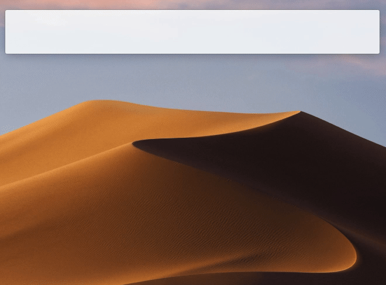

# alfred-bunch

> Run bunches using [Brett Terpstra's awesome Bunch app](https://brettterpstra.com/projects/bunch/) in macOS



## Install

```
$ npm install --global alfred-bunch
```

## Configuration

1. Open Alfred Preferences. 
2. Click on the "Workflows" tab and find Bunch.
3. Click on the "Configure workflow and variables" button.
4. Add the path to your Bunches folder in Workflow Environment Variables:
    - `bunchLocation`: `/Users/yourname/bunches`
5. Click "Save"

*Requires [Node.js](https://nodejs.org) 4+ and the Alfred [Powerpack](https://www.alfredapp.com/powerpack/).*

## Usage

In Alfred, type `bn`, optionally filter the list by typing some keywords. Press <kbd>Enter</kbd> to run the selected bunch.

## Related

- [Alfy](https://github.com/sindresorhus/alfy) – Create Alfred workflows with ease

## License

MIT © [Matthew Johnson](https://github.com/mttjhn/alfred-bunch)